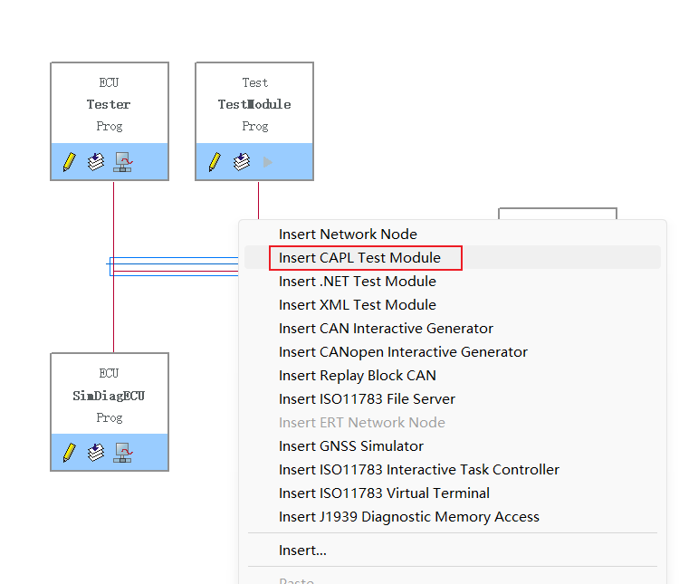
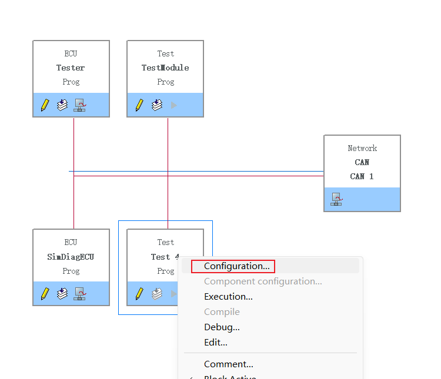
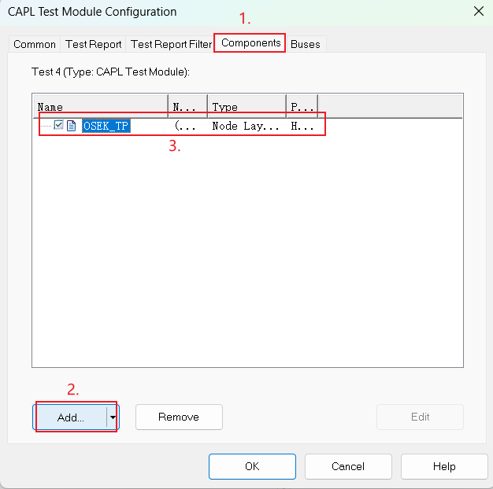
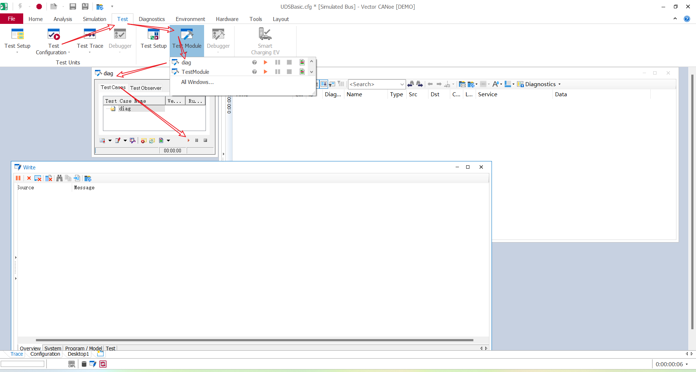
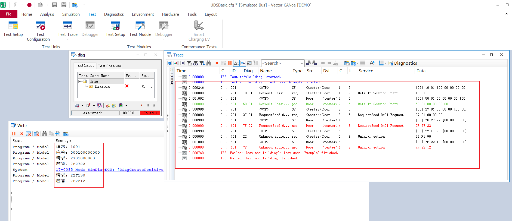
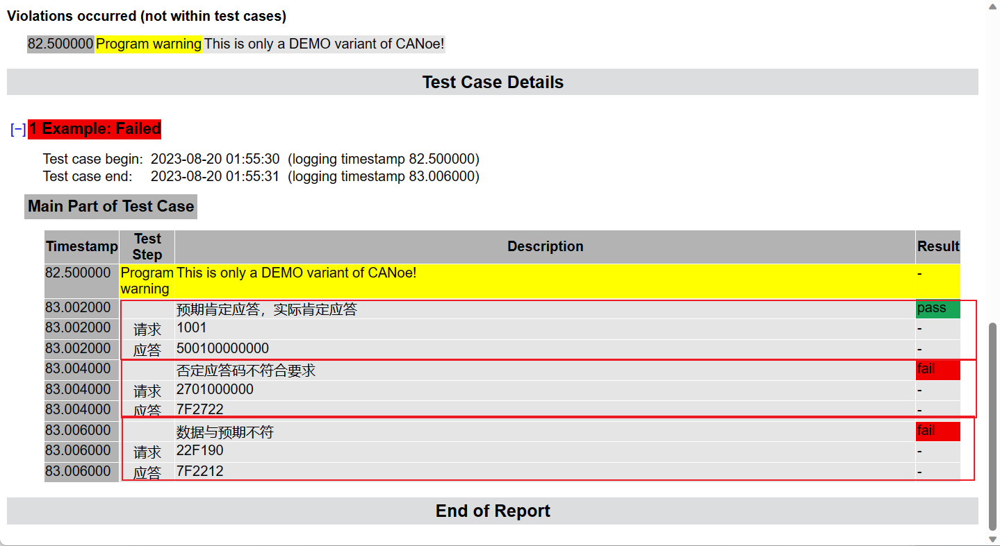

# 快速开始


## 运行环境

- CANoe 10及以上（更低版本未测试）
- ...

## 必要知识

> 本工具与osektp.dll强相关，如果想要使用的更舒服一点，还是需要了解一下osektp相关函数的

- CANoe的基本使用  [CANoe从入门到精通](https://weread.qq.com/web/bookDetail/23b327607199a63423b6861)

- CAPL 基本语法/C语言基础/其他任意一门语言基础 [C语言教程](https://www.bilibili.com/video/BV1dr4y1n7vA/?spm_id_from=333.337.search-card.all.click&vd_source=0af680642f7826957b766f9d51d43665)

## 配置环境

- 下载工具库到本地 [点击此处下载工具库]()

- 打开CANoe工程

- 建立Test节点

  

- 添加osektp.dll

  

  然后选择工具库存放位置/osek/osektp.dll

  

  最后点击OK保存即可

  

## 开始使用

在刚刚创建的测试节点中添加如下代码

```c
includes
{
  #include "H:\CAPL工具库\诊断发送和接收.can" // 导入工具库中与诊断相关的库
}


variables
{
  dword diagTx = 0x701;
  dword diagRx = 0x601;
  long handle;
}

MainTest(){
  handle = CreateCANConnection(diagTx,diagRx);
  Example();
}

testcase Example(){
  byte q27[5] = {0x27,0x01};
  sendDiag1001(handle);           // 发送 10 01
  AssertDiagTrue();               // 判断响应是否为肯定应答
  
  sendDiag(handle,q27);          // 发送 27 01 00 00 00
  AssertDiagFalseWithNRC(0x13);  // 判断应答是否为否定应答，并且否定应答码为0x13
  
  sendDiag22xxxx(handle,0xF190); // 发送22 F1 90
  AssertDiagCompareBytes(5,0x31);// 判断响应数据的第五个byte是否为0x31 （此处注意：从第一个有效数据开始计算）
}
```

然后调出测试面板，点击运行



可以看到脚本已经运行结束，并且会将诊断消息打印到Write面板



查看测试报告，目前报告比较简陋，只是将断言信息输出到测试报告中




## 常见问题

- 若是代码更新了但是执行测试用例时候发现没有运行，请删除cbf文件后重新运行（我在CANoe 17遇到过这类问题）
- 运行工程报错请仔细检查环境是否配好
- 安全解锁（0x27）功能需要工程中配好cdd和解锁dll
- 欢迎反馈bug，或者参与到工具库的开发之中 